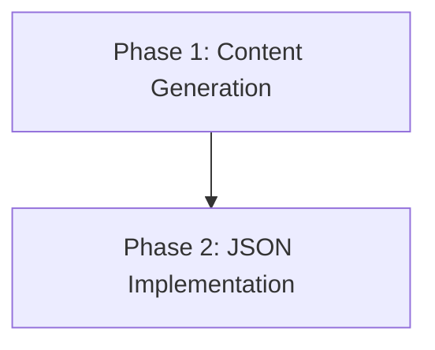

# Implementation Plan: Loading Screen Messages
**Date**: 2026-02-23  
**Status**: Proposed

## 1. Plan Overview
This plan covers the generation of 100 funny loading screen messages in German and English and their storage in a JSON file.

- **Total Phases**: 2
- **Agents Involved**: `technical_writer`, `coder`
- **Estimated Effort**: Low (Content-heavy)

## 2. Dependency Graph

## 3. Execution Strategy Table
| Phase | Agent | Objective | Mode |
|-------|-------|-----------|------|
| 1 | `technical_writer` | Generate 100 bilingual funny messages | Sequential |
| 2 | `coder` | Create and validate `assets/loading_messages.json` | Sequential |

## 4. Phase Details

### Phase 1: Content Generation
- **Objective**: Generate a list of 100 unique, funny loading screen messages in German and English.
- **Agent Assignment**: `technical_writer` (Expertise in content and tone).
- **Files to Create**: None (Output passed to next phase).
- **Files to Modify**: None.
- **Implementation Details**:
    - Messages should be "game engine" or "geek" themed.
    - Examples: "Reticulating splines", "Downloading more RAM", "Counting to infinity (twice)".
    - Each message must have a `de` and `en` version.
    - Provide the output in a format that the `coder` can easily convert to JSON.
- **Validation Criteria**:
    - Exactly 100 messages.
    - Both German and English provided for each.
- **Dependencies**: None.

### Phase 2: JSON Implementation
- **Objective**: Write the generated messages into `assets/loading_messages.json`.
- **Agent Assignment**: `coder` (Reliable file operations and JSON syntax).
- **Files to Create**:
    - `assets/loading_messages.json`: The final bilingual message repository.
- **Files to Modify**: None.
- **Implementation Details**:
    - Create the `assets/` directory if it doesn't exist (it should).
    - Write the JSON array of objects.
    - Ensure valid JSON syntax.
- **Validation Criteria**:
    - File exists at `assets/loading_messages.json`.
    - JSON is valid (test with `jq` or a small script if available).
    - Contains 100 entries.
- **Dependencies**: Blocked by Phase 1.

## 5. File Inventory
| File | Phase | Purpose |
|------|-------|---------|
| `assets/loading_messages.json` | 2 | Bilingual loading message repository |

## 6. Risk Classification
| Phase | Risk | Rationale |
|-------|------|-----------|
| 1 | LOW | Content generation is straightforward. |
| 2 | LOW | Simple file creation. |

## 7. Execution Profile
- **Total phases**: 2
- **Parallelizable phases**: 0
- **Sequential-only phases**: 2
- **Estimated sequential wall time**: 10-15 minutes.
