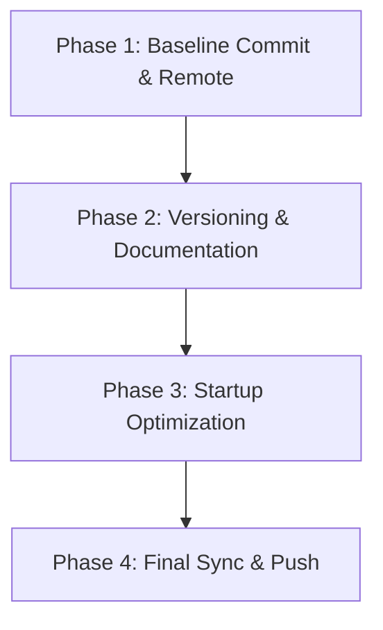

# Implementation Plan: Spark Engine v0.1.0 Baseline & Sync

## Plan Overview
This plan focuses on establishing a versioning baseline, optimizing startup time, and synchronizing the Spark Engine codebase with its GitHub repository.

- **Total Phases**: 4
- **Agents**: `devops_engineer`, `coder`
- **Estimated Effort**: Medium

## Dependency Graph

## Execution Strategy Table
| Stage | Description | Agent | Parallel |
|-------|-------------|-------|----------|
| 1 | Git Baseline | devops_engineer | No |
| 2 | Versioning | coder | No |
| 3 | Optimization | coder | No |
| 4 | GitHub Sync | devops_engineer | No |

## Phase Details

### Phase 1: Baseline Commit & Remote Setup
**Objective**: Clear pending changes and prepare for remote synchronization.
**Agent**: `devops_engineer`
**Files to Modify**: None (Staging current modifications)
**Details**:
- Run `git add .` to stage all current changes.
- Commit as "Baseline: Current state of engine before v0.1.0 versioning".
- Add remote: `git remote add origin https://github.com/Maxilo92/Spark`.
**Validation**:
- `git status` should be clean.
- `git remote -v` should show the origin URL.

### Phase 2: Versioning & Documentation
**Objective**: Establish formal versioning and change tracking.
**Agent**: `coder`
**Files to Create**:
- `src/Spark/Core/Version.h`: Define `SPARK_VERSION_STR` as "0.1.0".
- `CHANGELOG.md`: Standard Keep-a-Changelog format for `v0.1.0`.
**Files to Modify**:
- `src/Spark/Core/Application.cpp`: Include `Version.h` and update `UpdateWindowTitle` to use `SPARK_VERSION_STR`.
**Details**:
- Ensure `Version.h` uses `#pragma once`.
- `CHANGELOG.md` should mention "Added versioning", "Created Changelog", and "Removed artificial delay".
**Validation**:
- Check file contents.
- Verify `Application.cpp` compiles.

### Phase 3: Startup Optimization
**Objective**: Remove the artificial wait during initialization.
**Agent**: `coder`
**Files to Modify**:
- `src/Spark/Core/Application.cpp`: Delete the `usleep(1000000)` call.
**Details**:
- Ensure `m_IsLoading = false` happens immediately after layers are pushed.
**Validation**:
- Rebuild and run. Engine should show Editor/UI immediately after splash frames.

### Phase 4: Final Sync & Push
**Objective**: Push the formalized `v0.1.0` state to GitHub.
**Agent**: `devops_engineer`
**Files to Modify**: None
**Details**:
- Commit Phase 2 & 3 changes as "Formal v0.1.0: Added versioning and optimized startup".
- Push to GitHub: `git push -u origin master`.
**Validation**:
- Verify push success.

## File Inventory
| File | Action | Phase | Purpose |
|------|--------|-------|---------|
| `src/Spark/Core/Version.h` | Create | 2 | Central version definition |
| `CHANGELOG.md` | Create | 2 | Change tracking |
| `src/Spark/Core/Application.cpp` | Modify | 2, 3 | Integrate versioning and remove delay |

## Risk Classification
| Phase | Risk | Level | Rationale |
|-------|------|-------|-----------|
| 1 | Git conflicts | Medium | Staging current changes might include unwanted files; baseline commit is safer. |
| 4 | Push failure | Medium | If GitHub repo has content, force push might be needed (avoiding for now). |

## Execution Profile
- Total phases: 4
- Parallelizable phases: 0
- Sequential-only phases: 4
- Estimated wall time: 10 mins

## Cost Estimation
| Phase | Agent | Model | Est. Input | Est. Output | Est. Cost |
|-------|-------|-------|-----------|------------|----------|
| 1 | devops_engineer | flash | 2K | 500 | $0.005 |
| 2 | coder | pro | 5K | 1K | $0.09 |
| 3 | coder | pro | 3K | 500 | $0.05 |
| 4 | devops_engineer | flash | 2K | 500 | $0.005 |
| **Total** | | | | | **~$0.15** |
